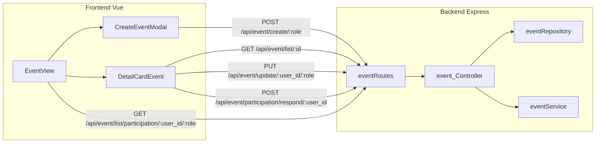
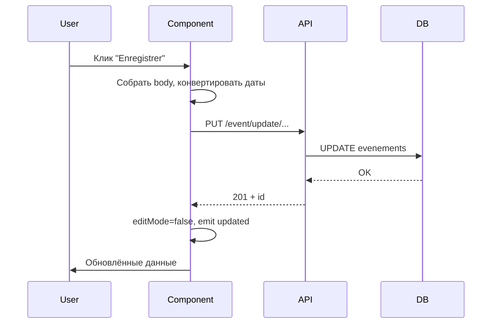

# Курс: добавление фич Events во фронтенд CoreFlow

> **Ваш прогресс:** Глава 1–3 — сданы | Задача 1 — сдана (~80/100) | C1 — сдана | C2 — сдана | C4 respond — сдана | Далее: Задача 3 (фильтр type)  
> Оригинал плана: `C:\Users\vadim\.cursor\plans\курс_events_frontend_cd0d2949.plan.md`

## Контекст проекта

Вы хорошо знаете бэкенд — это ваше преимущество. Фронтенд построен на **Vue 3 (Options API)** + **Vue Router** + **fetch/axios** к REST API. Главная идея: **фронтенд — это тонкий клиент**, который отправляет JSON на ваши эндпоинты и отображает ответ.



### Карта файлов (что за что отвечает)

| Слой | Файл | Роль |
|------|------|------|
| Маршруты API | [Backend/src/routes/eventRoutes.js](Backend/src/routes/eventRoutes.js) | URL → контроллер |
| Бизнес-логика | [Backend/src/controllers/event_Controller.js](Backend/src/controllers/event_Controller.js) | Валидация, маппинг полей, ответы JSON |
| SQL | [Backend/src/repository/eventRepository.js](Backend/src/repository/eventRepository.js) | Запросы к MySQL |
| Страница-календарь | [Frontend/src/views/EventView.vue](Frontend/src/views/EventView.vue) | Загрузка списка, календарь, модалки |
| Создание | [Frontend/src/components/CreateEventModal.vue](Frontend/src/components/CreateEventModal.vue) | Форма + POST create |
| Детали/редакт/удаление | [Frontend/src/components/DetailCardEvent.vue](Frontend/src/components/DetailCardEvent.vue) | GET by id, DELETE, **update — заглушка** |
| Auth/API | [Frontend/src/composables/useAuth.js](Frontend/src/composables/useAuth.js) | `API_URL`, `fetchUserFromToken`, `hasRole` |
| Глобальный fetch | [Frontend/src/main.js](Frontend/src/main.js) | Авто-подстановка JWT, фикс URL |

### Что уже работает vs что сломано/отсутствует

**Работает:**
- Список событий в календаре ([EventView.vue](Frontend/src/views/EventView.vue) → `GET /event/list/participation/...`)
- Создание события ([CreateEventModal.vue](Frontend/src/components/CreateEventModal.vue) → `POST /event/create/:role`)
- Просмотр и удаление ([DetailCardEvent.vue](Frontend/src/components/DetailCardEvent.vue))

**Не работает / отсутствует (ваши экзаменационные задачи):**
1. **Редактирование** — форма есть, но `handleUpdate()` показывает только `alert` (строка 456 в DetailCardEvent)
2. **Ответ на приглашение** — бэкенд `POST /event/participation/respond/:user_id` есть, UI нет
3. **Фильтр по типу на календаре** — в контроллере есть `req.query.type`, но на фронте в EventView фильтра нет (в repository `typeFilter` пока тоже не применяется в SQL — опциональная доработка бэкенда)

---

## Глава 1. Минимум Vue, который нужен для этого проекта

### Теория

**1.1. Структура `.vue` файла**
- `<template>` — HTML с директивами Vue (`v-if`, `v-for`, `v-model`, `@click`)
- `<script>` — логика: `data()`, `computed`, `methods`, `watch`, `mounted`
- `<style scoped>` — CSS только для этого компонента

**1.2. Реактивность**
- `data()` возвращает объект состояния; при изменении — UI обновляется
- `computed` — вычисляемые свойства (кэшируются), пример: `canCreateEvent` в EventView
- `watch` — реакция на изменение prop/data, пример: `eventId` в DetailCardEvent запускает `fetchEvent`

**1.3. Props и Events (связь родитель ↔ ребёнок)**
```javascript
// Родитель EventView.vue
<DetailCardEvent :show="showDetailModal" :event-id="selectedEventId" :user="user" @close="..." @updated="onEventUpdated" />

// Ребёнок DetailCardEvent.vue
props: { show, eventId, user }
emits: ['close', 'updated']
```
- **Props вниз** — родитель передаёт данные
- **Events вверх** — ребёнок сообщает родителю (`$emit('updated')`)

**1.4. Жизненный цикл**
- `mounted()` — после отрисовки; здесь проверяют token и загружают данные

**1.5. Как фронт ходит на бэкенд**
```javascript
const res = await fetch(`${API_URL}/event/list/${id}`, {
  headers: { Authorization: `Bearer ${token}` }
})
const data = await res.json()
```
В [main.js](Frontend/src/main.js) токен подставляется автоматически для всех `/api/` запросов.

### Вопросы для самопроверки (Глава 1)

1. Чем `data()` отличается от `computed`? Приведите пример из EventView.
2. Что делает `v-model="formData.titre"` в CreateEventModal?
3. Зачем DetailCardEvent использует `watch` на `eventId`?
4. Что произойдёт, если ребёнок вызовет `this.$emit('updated')`?
5. Где в проекте хранится JWT и как он попадает в заголовок запроса?

### Мини-практика (Глава 1)

Откройте [EventView.vue](Frontend/src/views/EventView.vue) и проследите цепочку:
`mounted` → `fetchUserFromToken` → `fetchEvents` → `this.events` → `getEventsForDay` → отрисовка в календаре.

Нарисуйте на бумаге: какие переменные меняются при клике на событие в календаре.

---

## Глава 2. Бэкенд Events — то, что вы уже знаете, но с фронтовой призмы

### Теория

**2.1. Маппинг полей** ([event_Controller.js](Backend/src/controllers/event_Controller.js), `mapEventBody`)

Бэкенд принимает **французские имена полей** из JSON:

| JSON (фронт → бэк) | Внутреннее имя | Колонка БД |
|--------------------|----------------|------------|
| `titre` | `title` | `titre` |
| `date_debut` | `startDate` | `date_debut` |
| `date_fin` | `endDate` | `date_fin` |
| `organisateur_id` | `organizerId` | `organisateur_id` |
| `type_evenement` | `eventType` | `type_evenement` |
| `niveau` | `level` | `niveau` |

**Важно для фронта:** отправляйте `titre`, `date_debut`, а не `title`, `startDate`.

**2.2. Формат дат**
- Бэкенд ожидает: `"2026-06-18 09:00:00"` (пробел, не `T`)
- HTML `<input type="datetime-local">` даёт: `"2026-06-18T09:00"`
- В CreateEventModal есть конвертер `toBackendDate()` — **скопируйте этот паттерн** для update

**2.3. Все эндпоинты Events**

| Метод | URL | Контроллер | Статус на фронте |
|-------|-----|------------|------------------|
| GET | `/api/event/list/participation/:user_id/:userRole` (+ опц. `?type=`) | `event_list` | Работает (EventView), **фильтр `type` на фронте не подключён** |
| GET | `/api/event/list/:id` | `event_list_by_id` | Работает (DetailCardEvent) |
| POST | `/api/event/create/:userRole` | `event_create` | Работает (CreateEventModal) |
| PUT | `/api/event/update/:user_id/:userRole` | `event_update` | **Нет на фронте** |
| DELETE | `/api/event/delete/:id/:userRole/:user_id/` | `event_delete` | Работает |
| POST | `/api/event/participation/respond/:user_id` | `event_respond` | **Нет на фронте** |

**2.4. Ответы API (что парсить на фронте)**

`event_list_by_id` успех:
```json
{ "message": 1, "event": [{ "id": 5, "titre": "...", "date_debut": "...", ... }] }
```

`event_update` успех:
```json
{ "message": "La modification a réussi", "id": 5 }
```

`event_respond` — body: `{ "eventId": 5, "userId": 3, "status": "accepte" }` (уточните допустимые значения `status` в таблице `participations`)

### Вопросы для самопроверки (Глава 2)

1. Какой URL и метод использует CreateEventModal для создания?
2. Почему нельзя отправить `date_debut: "2026-06-18T09:00"` без конвертации?
3. Какие поля обязательны для `event_update` согласно `validateUpdateEvent`?
4. Чем отличается ответ `event_list` для admin vs обычного пользователя?
5. Где в `event_Controller` читается `req.query.type` и зачем это может пригодиться на фронте?

### Мини-практика (Глава 2)

Через Postman/Thunder Client (или curl) вызовите:
- `GET /api/event/list/participation/:your_user_id/:your_role` с Bearer token
- Запишите уникальные значения `type_evenement` в ответе — они понадобятся для фильтра

---

## Глава 3. Анатомия компонентов Events

### Теория

**3.1. EventView — оркестратор**
- Загружает `this.events` один раз в `fetchEvents`
- Календарь — чистая логика дат в `computed calendarCells` + `getEventsForDay`
- Управляет двумя модалками через boolean-флаги: `showCreateModal`, `showDetailModal`
- После create/update/delete — перезагружает список через `fetchEvents`

**3.2. CreateEventModal — образец правильного API-вызова**

Изучите `handleSubmit()` в [CreateEventModal.vue](Frontend/src/components/CreateEventModal.vue):
1. Валидация на клиенте (роль, даты)
2. Сбор `body` с французскими именами полей
3. `fetch` + обработка ошибок через `parseApiError`
4. `$emit('submit')` при успехе

**Это ваш шаблон для любой новой фичи.**

**3.3. DetailCardEvent — модалка с режимами**

Два режима UI:
- `!editMode` — просмотр
- `editMode` — форма (`editForm` — копия `event`)

Сейчас `handleUpdate` — заглушка:
```455:457:Frontend/src/components/DetailCardEvent.vue
    async handleUpdate() {
      alert("La modification d'événement n'est pas disponible pour le moment.")
    },
```

**3.4. Паттерн «добавить фичу» (алгоритм на 6 шагов)**

1. Найти эндпоинт на бэкенде (уже есть?)
2. Понять формат request/response
3. Добавить UI-элемент (кнопка, форма, поле)
4. Написать method с `fetch` (скопировать стиль из соседнего метода)
5. Обработать успех (обновить state, `$emit`, закрыть модалку)
6. Обработать ошибку (показать `errorMessage`)



### Вопросы для самопроверки (Глава 3)

1. Почему после удаления события DetailCardEvent вызывает `$emit('updated')`?
2. Как CreateEventModal узнаёт `organisateur_id`?
3. Что делает `toBackendDate` и зачем?
4. В чём разница между `import { API_URL }` и `import.meta.env.VITE_API_BASE`?
5. Назовите 3 файла, которые придётся трогать для задачи «ответ на приглашение».
6. Как `getEventsForDay` использует `this.events` и куда встроить фильтр по типу?

### Практика (Глава 3)

**Упражнение A (без кода):** Опишите словами, что должен делать `handleUpdate` — пошагово, как в CreateEventModal.handleSubmit.

**Упражнение B (чтение кода):** Сравните `handleDelete` и заглушку `handleUpdate` в DetailCardEvent — какие части можно переиспользовать?

---

## Глава 4. Задача 1 — Редактирование события (практика с подсказками)

### Теория

PUT `/api/event/update/:user_id/:userRole` принимает body с полями из `mapEventBody`. Минимум для update:
- `id` — ID события
- `organisateur_id` — ID организатора (для проверки прав в repository)
- Любые изменяемые поля (`titre`, `description`, `date_debut`, ...)

Фронт должен:
1. Взять `editForm`
2. Конвертировать `date_debut` / `date_fin` из `datetime-local` в формат бэкенда
3. Добавить `id` и `organisateur_id` из `this.event`
4. Отправить PUT
5. При успехе: `editMode = false`, `fetchEvent(id)`, `$emit('updated')`

### Контрольные вопросы перед кодом

1. Какой HTTP-метод и URL?
2. Откуда взять `user_id` и `userRole`?
3. Что показать пользователю при ошибке 403?

### Практика (пошагово)

**Шаг 1:** В `handleUpdate` добавьте `updateLoading = true` и сброс `updateError`.

**Шаг 2:** Скопируйте `toBackendDate` из CreateEventModal (или вынесите в утилиту).

**Шаг 3:** Соберите body:
```javascript
const body = {
  id: this.event.id,
  organisateur_id: this.event.organisateur_id,
  titre: this.editForm.titre,
  description: this.editForm.description,
  type_evenement: this.editForm.type_evenement,
  date_debut: toBackendDate(this.editForm.date_debut),
  date_fin: toBackendDate(this.editForm.date_fin),
  lieu: this.editForm.lieu,
  statut: this.editForm.statut,
  niveau: this.editForm.niveau,
  nb_places_max: this.editForm.nb_places_max,
  est_obligatoire: this.editForm.est_obligatoire,
}
```

**Шаг 4:** fetch PUT на `${API_URL}/event/update/${userId}/${role}`

**Шаг 5:** При `res.ok` — выйти из editMode, перезагрузить событие, emit `updated`.

**Шаг 6:** Конвертация дат для `datetime-local` при `startEdit`: бэкенд отдаёт `"2026-06-18 09:00:00"`, input нужен `"2026-06-18T09:00"` — добавьте helper `toInputDateTime(str)`.

### Критерии приёмки задачи 1

- [ ] Кнопка «Modifier» → изменить titre → «Enregistrer» → без alert
- [ ] После сохранения данные обновляются в модалке
- [ ] Календарь в EventView обновляется (через `@updated="onEventUpdated"`)
- [ ] Ошибка API показывается в `updateError`, не в alert
- [ ] Кнопка disabled во время `updateLoading`

---

## Глава 5. Задача 2 — Ответ на приглашение (Participation)

### Теория

Бэкенд: `POST /api/event/participation/respond/:user_id`
```json
{ "eventId": 5, "userId": 3, "status": "accepte" }
```

Логика в [event_Controller.js](Backend/src/controllers/event_Controller.js) `event_respond` → `Event.updateParticipation`.

**Где добавить UI:** [DetailCardEvent.vue](Frontend/src/components/DetailCardEvent.vue) — в режиме просмотра, если текущий пользователь — приглашённый участник (не организатор).

**Как узнать статус участия:** Сейчас `GET /event/list/:id` возвращает только данные из `evenements`, без participations. Варианты:
- **A (рекомендуется для экзамена):** Добавить на бэкенд JOIN participations в `listById` — вы это умеете
- **B (только фронт):** Использовать данные из `event_list` если там есть `statut_participation` — проверить реальный ответ API

### Вопросы

1. Какие роли могут отвечать на приглашение?
2. Какие значения `status` допустимы в ENUM таблицы `participations`?
3. Должны ли кнопки быть видны организатору?

### Практика

**Шаг 1:** Узнать/добавить в API поле `statut_participation` для текущего user.

**Шаг 2:** В template DetailCardEvent добавить блок:
```html
<div v-if="canRespond" class="participation-actions">
  <button @click="respond('accepte')">Принять</button>
  <button @click="respond('refuse')">Отклонить</button>
</div>
```

**Шаг 3:** `computed canRespond` — user не организатор, статус `en_attente`.

**Шаг 4:** Метод `respond(status)` → POST → обновить UI.

### Критерии приёмки задачи 2

- [ ] Приглашённый пользователь видит кнопки на событии со статусом `en_attente`
- [ ] После клика статус меняется в БД
- [ ] UI отражает новый статус (бейдж «Принято» / «Отклонено»)
- [ ] Организатор не видит эти кнопки

---

## Глава 6. Задача 3 — Фильтр по типу события на календаре

### Теория

В [event_Controller.js](Backend/src/controllers/event_Controller.js) при списке событий уже читается query-параметр:
```javascript
const typeFilter = req.query.type;
Event.listAll(userId, userRole, typeFilter, ...)
```

Допустимые типы в БД (ENUM): `reunion`, `formation`, `afterwork`, `seminaire`, `autre`.

На фронте в [EventView.vue](Frontend/src/views/EventView.vue) все события попадают в `this.events`, а календарь рисуется через `getEventsForDay(cell)`, который фильтрует по дате. **Фильтра по типу нет.**

Два уровня реализации (выберите на экзамене минимум уровень A):

**Уровень A — только фронт (достаточно для зачёта):**
- Добавить `<select v-model="selectedType">` над календарём
- Ввести `computed filteredEvents` — если `selectedType` пустой, вернуть все `events`, иначе отфильтровать по `type_evenement`
- В `getEventsForDay` использовать `filteredEvents` вместо `this.events`

**Уровень B — фронт + бэкенд (бонус +5 баллов):**
- В [eventRepository.js](Backend/src/repository/eventRepository.js) в `listAll` добавить `AND type_evenement = ?` когда `typeFilter` задан
- В `fetchEvents` передавать `?type=${selectedType}` и перезагружать список при смене фильтра

### Вопросы

1. Чем отличается фильтрация на клиенте от фильтрации через query-параметр API?
2. Почему фильтр логичнее вынести в `computed`, а не дублировать в `getEventsForDay`?
3. Что показать пользователю, если после фильтра на месяце нет ни одного события?

### Практика

**Шаг 1:** В `data()` добавить `selectedType: ''` (пустая строка = «Все типы»).

**Шаг 2:** В template над `.calendar-nav` добавить select:
```html
<select v-model="selectedType">
  <option value="">Tous les types</option>
  <option value="reunion">Réunion</option>
  <option value="formation">Formation</option>
  <!-- ... -->
</select>
```

**Шаг 3:** Добавить computed:
```javascript
filteredEvents() {
  if (!this.selectedType) return this.events
  return this.events.filter(e => e.type_evenement === this.selectedType)
}
```

**Шаг 4:** В `getEventsForDay` заменить `this.events` на `this.filteredEvents`.

**Шаг 5 (опционально):** При смене `selectedType` вызывать `fetchEvents` с query-параметром.

### Критерии приёмки задачи 3

- [ ] Над календарём есть выпадающий список типов + пункт «Все»
- [ ] При выборе типа на календаре остаются только события этого типа
- [ ] Клик по событию и создание нового события по-прежнему работают
- [ ] Сброс фильтра («Все») возвращает полный список
- [ ] (Бонус) Фильтр работает через `?type=` на API

---

## Глава 7. Финальный экзамен

### Формат

Вы работаете **самостоятельно**. Я выступаю экзаменатором: задаю вопросы, вы сдаёте код и демонстрацию.

### Часть A — Устный блок (20 мин)

Ответьте письменно на 10 вопросов:
1. Опишите поток данных при клике на день календаря → создание события.
2. Что такое `props`, `emits`, `v-model` — пример из проекта каждого.
3. Зачем `mapEventBody` на бэкенде?
4. Как `getEventsForDay` связан с `this.events` и где лучше применить фильтр по типу?
5. Как работает auth middleware на маршрутах Events?
6. Что делает `watch` в DetailCardEvent?
7. Как конвертировать дату между `datetime-local` и MySQL DATETIME?
8. Почему после мутации данных нужен `$emit('updated')`?
9. Какие роли могут создавать/удалять события?
10. Как бы вы добавили фильтр по `type_evenement` на календаре?

### Часть B — Практический блок (3 задачи)

| # | Задача | Файлы | Баллы |
|---|--------|-------|-------|
| 1 | Реализовать `handleUpdate` + конвертация дат | DetailCardEvent.vue | 35 |
| 2 | Кнопки «Принять/Отклонить» приглашение | DetailCardEvent.vue + возможно eventRepository | 35 |
| 3 | Фильтр по `type_evenement` на календаре | EventView.vue (+ опционально eventRepository.js) | 30 |

### Часть C — Демонстрация (10 мин)

Запустите проект, покажите в браузере:
1. Редактирование названия события → сохранение → обновление в календаре
2. Вход как приглашённый employee → ответ на приглашение
3. Фильтр по типу на календаре → выбор «Réunion» → на календаре только реунионы

### Шкала оценки

- **90–100:** все критерии + чистый код, обработка ошибок, без лишних alert
- **70–89:** все 3 задачи работают, мелкие недочёты UI
- **50–69:** 2 из 3 задач
- **<50:** нужно повторить главы 1–3

### Типичные ошибки (экзаменатор проверит)

- Отправка `date_debut` с буквой `T` без конвертации
- Забыли `organisateur_id` в body update → 403/400
- Не вызвали `fetchEvents` после изменений
- Путаница `API_URL` vs `VITE_API_BASE` (оба работают, но будьте последовательны)
- Не обработали `res.ok === false`

---

## Порядок прохождения курса

1. Главы 1–3 (теория + вопросы) — **2–3 часа**
2. Глава 4, задача 1 — **1–2 часа**
3. Глава 5, задача 2 — **2–3 часа** (возможна доработка бэкенда)
4. Глава 6, задача 3 — **~1 час**
5. Глава 7, экзамен — **2–3 часа**

**Итого:** ~8–12 часов

---

## Как мы будем работать в чате

После подтверждения плана:
1. Я проведу вас по главам последовательно
2. После каждой главы — проверю ответы на вопросы
3. На практике — вы пишете код, я ревью как экзаменатор
4. Финал — сдаёте все 3 задачи, я ставлю оценку

Начнём с **Главы 1**, когда скажете «готов».
